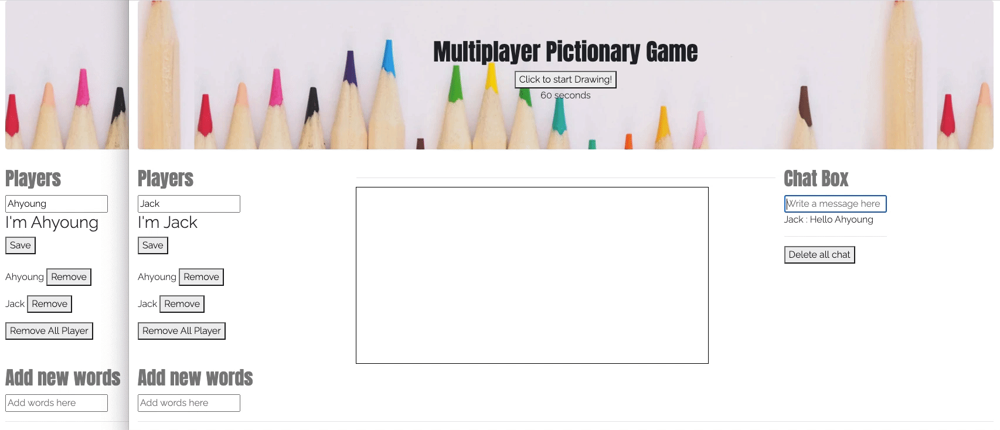

# Pictionary App-prototype
This project was built for MSTU 5013 Theory and Programming of Interactive Media in 2020. 
The file structure was designed to meet the project's requirements.

## About the project
This is a pictionary App that you can play with your friends. It utilize Javascript and vue for frontend 
and firebase in backend.

## How to play
To start playing, enter your name on the left-hand side. 
Once your friend joins, click the "click to start draw" button. 
A timer will indicate how much time your friend has to guess. 

This is a prototype for a potential project using express.js and Socket.io.



## Features
* Real-time chat
* Real-time drawing
* Customizable brush color and thickness
* Ability to insert new words
* Scoring system based on each player's guess.

## Implementation and limitation
The Pictionary App prototype utilizes the Canvas API and Firebase to allow users to draw pictures and share their drawing data with each other in real-time. 
As a result, the speed and volume of data transmission is exponential. 
Following code example includes the drawing event (onMousemove()) and the sending of x and y coordinate data to Firebase.
``` 
    onMousemove(e) {
        if (this.draw === false) {
            return null;
        } else {
            this.ctx.lineTo(e.pageX - this.rect.left, e.pageY - this.rect.top);
            this.ctx.stroke();

            //console.log(e.pageX, e.pageY);

            this.x = e.pageX - this.rect.left - 97.5 * 2;
            this.y = e.pageY - this.rect.top;
        }
        canvasRef.doc("drawing").update({
            x: this.x,
            y: this.y
        });
    }
```
In future implementations, Socket.io would be the perfect fit to enable the real-time drawing feature. It offers low-latency, bidirectional, and event-based communication between a client and a server, making it an ideal choice.

## License

Distributed under the MIT License. See `LICENSE` for more information.
